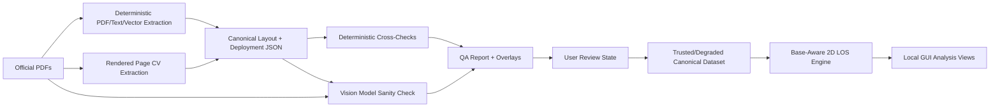

# Warhammer 40k LOS Analysis Tool Design

Date: 2026-06-16

## Goal

Build a local web application for visual analysis of Warhammer 40k table layouts, focused on base-aware 2D line-of-sight, firing-lane heatmaps, deployment exposure, terrain coverage, and interactive LOS simulation.

The app must automatically download and process the user-provided official terrain footprint and core rules PDFs:

- Terrain area footprints: `https://assets.warhammer-community.com/eng_12-06_warhammer40000_terrainareafootprints-biavo5zf9f-gxdahkydbj.pdf`
- Core rules: `https://assets.warhammer-community.com/eng_01-06_warhammer40k_new40k_core_rules-was6fbu1ix-hfewhmxyiy.pdf`

The first release is accepted only when all deterministic backend tests, schema validation tests, extraction regression fixtures, and Playwright GUI tests pass offline against pinned fixtures. Vision-model checks are excluded from required CI gates.

## Scope

The first implementation is a local GUI application with an extraction backend and interactive strategy views. It must:

1. Download and cache the official PDFs through a pinned source manifest.
2. Extract terrain layouts, footprints, LOS-blocking wall or solid segments, board bounds, labels, and deployment-zone geometry automatically.
3. Use robust deterministic PDF parsing, text/vector extraction, and computer vision for production extraction.
4. Use a vision model only as a verifier/test oracle, never as the canonical geometry generator.
5. Normalize extracted geometry into canonical JSON.
6. Render QA overlays that compare extracted geometry against PDF page images.
7. Simulate base-aware 2D LOS.
8. Generate firing-lane heatmaps from many possible firing positions.
9. Generate movement/deployment exposure maps.
10. Show per-terrain coverage and interactive point/base LOS views.

Future builds may add height-aware or full 3D-aware LOS, but the first release stays 2D and base-aware.

## Architecture

Use a Python-only local web application. FastAPI owns the extraction and simulation APIs, serves the local GUI, and hosts static browser assets. The browser UI should use server-rendered HTML templates, CSS, and small vanilla JavaScript modules for Canvas/SVG interaction; no Node, npm, React, Vite, or TypeScript build chain is required for the first release.

The backend owns:

- PDF download and caching.
- PDF rendering to images.
- Text and vector extraction.
- Deterministic computer vision extraction.
- Geometry normalization.
- Deployment-zone extraction.
- Cross-checking stated and inferred measurements.
- Optional vision-model sanity checks.
- LOS and heatmap computation APIs.

The Python-served browser UI owns:

- Local GUI shell.
- Board rendering.
- Source-PDF underlay display.
- Terrain, wall, deployment, and warning overlays.
- Base-size and analysis controls.
- LOS simulator interactions.
- Firing-lane heatmaps.
- Deployment exposure maps.
- Terrain coverage views.

The production data flow is:

The simulator consumes canonical JSON only. Raw PDF pixels are used for overlays and verification, not direct gameplay analysis.

## Source Manifest And Reproducibility

Each source PDF must be pinned in `pdf_manifest.json` before extraction. The manifest must include:

- Original URL and final resolved URL.
- SHA-256 hash.
- Byte length.
- Retrieval date.
- Cache filename.
- Fixture version.
- Expected page count.
- Supported page inventory, including page numbers, page labels, extraction task type, expected layout ids, expected board sizes, expected terrain counts, expected blocker counts, and expected deployment names where applicable.

Extraction must fail closed on hash mismatch unless the manifest is intentionally updated. CI must use cached PDFs from the manifest and run without network access.

Public repository workflows must not assume the official PDF binaries can be redistributed. The default public repo should commit source URLs, hashes, schemas, deterministic code, synthetic fixtures, and copyright-safe golden outputs. Official PDFs belong in a gitignored local cache or a private/manual CI cache unless redistribution is explicitly permitted. The full release gate still requires running official-PDF extraction regression against the pinned cache.

## Canonical Data Model

Each extracted layout should be stored as versioned canonical JSON with sorted keys, fixed float precision, explicit units, required status enums, and `schema_version`. The backend must generate JSON Schema from Pydantic models. The browser UI consumes JSON directly from FastAPI endpoints and does not require a separate generated frontend schema package.

Canonical layout hashes must exclude timestamps, absolute local paths, and machine-specific metadata. Those volatile values belong in `run_metadata`, not in the canonical layout object.

Canonical JSON should include these top-level areas:

- `source`: manifest id, original URL, final resolved URL, PDF SHA-256, byte length, page number, fixture version, render profile id, extraction version, and supported-page inventory reference.
- `board`: physical dimensions in inches, detected pixel bounds, PDF page box, page rotation, render matrix, `pixel_to_pdf`, `pdf_to_board`, `board_to_pdf`, coordinate origin, axis direction, rounding grid, and transform residuals.
- `terrain_layout`: layout id, page label, terrain features, footprint polygons, LOS-blocking wall or solid segments, feature labels, feature-level status, and per-geometry blocking flags.
- `deployment`: deployment name, source page, deployment-zone polygons, no-man's-land geometry, stated distances, inferred distances, validation status, and per-edge provenance.
- `validation`: stated-vs-inferred measurement comparisons, vector-vs-image comparisons, tolerance results, warning records, readiness state, and deterministic validation status.
- `advisory_vision`: optional vision-model verifier output, stored separately from deterministic validation.
- `run_metadata`: local cache path, extraction timestamp, machine-specific paths, and runtime environment details excluded from canonical hashes.
- `rules_assumptions`: 2D LOS assumptions, base-size assumptions, terrain-blocking assumptions, unsupported rules interactions, and future 3D extension notes.

Coordinates are normalized to board inches. The board should use one consistent origin, documented in the JSON schema and frontend renderer.

Each feature, footprint, wall segment, deployment polygon, and deployment edge must include feature-level provenance:

- `source_page`
- `source_pdf_hash`
- `extraction_path`
- `source_bbox_px`
- `pdf_object_ids` or `path_ids` when available
- `text_span_ids` when applicable
- `cv_contour_id` when applicable
- `source_text_ref` or `measurement_ref` when applicable
- raw coordinates before normalization
- normalized board-inch coordinates
- `confidence`
- `status`
- `validation_messages`
- `blocks_los`
- `blocks_movement`
- `base_blocker`
- `context_only`
- `source_evidence`

Footprints default to `blocks_los=false` and `context_only=true`. Extracted wall or solid segments default to `blocks_los=true`. Movement blocking is false unless a deterministic rule or extraction-class manifest marks `blocks_movement=true`.

## Extraction Contract

Extraction must use two independent deterministic paths for supported fixture pages:

1. Rendered/image inference detects the board, footprints, wall segments, labels, and page layout, then converts pixels to inches.
2. Text/vector inference extracts stated distances, dimension labels, layout identifiers, deployment-zone definitions, and PDF vector geometry where available.

For supported pages, board bounds, scale, terrain footprints, blockers, labels, and deployment zones must be produced by deterministic extraction and cross-checked where both raster and vector/text evidence exist. If one evidence path is unavailable, the field must be marked `unsupported` with a reason and cannot be marked `verified`.

Precedence rules:

- PDF vector geometry is canonical when it directly represents the target geometry class.
- Text/vector measurements are canonical for stated distances and deterministic deployment definitions.
- CV may confirm vector/text extraction or recover geometry classes explicitly allowed by the page inventory.
- CV-only geometry is not production-ready unless it is manually accepted in the review workflow or covered by fixture evidence for that source page.
- Vision-model output never participates in canonical extraction precedence.

Text extraction must preserve text spans with coordinates and use a deterministic grammar for labels, dimensions, fractions, inch marks, hyphens, ligatures, and rotated text. Unsupported or ambiguous parses must emit `unsupported_text_parse`, not inferred geometry.

OCR, if used, must be deterministic, local, version-pinned, confidence-thresholded, coordinate-preserving, and fixture-tested. Vision models must not substitute for OCR.

Blocker classification must be derived from documented PDF legend/style rules: stroke color, fill color, line width, path type, layer/name when available, and page-specific exceptions. These rules belong in an extraction-class manifest.

The validator compares these paths:

- If text/vector and CV agree within tolerance, mark the feature verified.
- If CV detects a shape that text/vector misses, keep it provisional and flag it.
- If text/vector states a measurement and CV disagrees, do not silently correct it; mark a contradiction and show both values.
- If terrain or deployment geometry is deterministic from the source material, infer expected values and compare extracted values against those expectations.
- If the vision-model verifier reports that the rendered extraction does not visually resemble the source PDF image, mark the layout visually suspicious without mutating geometry.

The verifier should distinguish at least these states:

- `verified`
- `provisional`
- `accepted`
- `accepted_with_warnings`
- `rejected`
- `needs_review`
- `missing`
- `contradicted`
- `low_confidence`
- `vision_suspicious`
- `unsupported`

Warnings must be machine-readable and include `id`, `severity`, `status`, `affected_entities`, `source`, `message`, `recommended_action`, and `blocks_views`.

## Analysis Readiness Gates

Every layout and strategy view must have an analysis validity state:

- `trusted`: all required board transform, blocker, footprint, and selected deployment geometry is `verified` or explicitly `accepted`.
- `degraded`: analysis can run only with visible warnings because some non-required geometry is `provisional`, or because required geometry is `accepted_with_warnings`, stale, or vision-suspicious.
- `blocked`: analysis must not run because board transforms, board bounds, required blockers, required deployments, or canonical geometry are missing, contradicted, rejected, or invalid.

LOS and heatmap APIs must refuse production analysis unless board transform, blockers, footprints, and selected deployment are `verified`, `accepted`, or explicitly `accepted_with_warnings`. Required provisional geometry must be user-reviewed into `accepted_with_warnings` before production analysis can run. Stale cached layouts may be displayed with warnings, but new production analysis may run on stale data only after explicit user acknowledgement and never when the current PDF hash contradicts the pinned source manifest.

## Vision Model Boundary

The vision model is allowed only for sanity checking and testing. It may compare a source PDF page image against a rendered image of extracted footprints, walls, labels, and deployment zones.

It must not:

- Create canonical footprint geometry.
- Rewrite wall segments.
- Infer deployment zones for production use.
- Override deterministic extraction.
- Be required for unit tests to pass.

Its output must be advisory and stored in the separate `advisory_vision` block with provider, model id, prompt version, source image hash, rendered overlay image hash, canonical JSON hash, verdict schema, timestamp, cached response hash, a short explanation, and optionally coarse regions of concern for the QA overlay. Vision-model checks are disabled in default CI. Vision failure may mark `vision_suspicious`, but must not change deterministic validation status or fail deterministic test jobs.

## LOS Model

The first LOS engine is base-aware 2D LOS.

Rules:

- A model is represented as a circular base on the board.
- Point LOS is available as a fast mode for heatmaps and debugging.
- Base inputs are stored as `diameter_mm` and `radius_inches` using 25.4 mm per inch.
- A legal base center must keep the full disk inside the board and outside any geometry marked `base_blocker=true`.
- Base-aware LOS is visible if and only if there exists at least one segment from any point in the firing base disk to any point in the target base disk whose open interior is not blocked by LOS blockers.
- A blocker is a closed segment. LOS is blocked when the sight segment intersects the blocker relative interior or overlaps it by more than `geometry_epsilon`.
- Touching only a blocker endpoint is not blocked unless that endpoint is marked sealed.
- LOS-blocking wall or solid segments block visibility according to those geometry predicates.
- Terrain footprint polygons provide context, identity, and coverage analysis, but do not block LOS unless the extracted/rules geometry marks them as blockers.
- The board boundary clips all visibility and movement outputs.

The engine should be designed so future versions can add terrain height tiers, model height, windows/openings, and full 3D-aware LOS without replacing the canonical geometry model.

## GUI Views

### Layout QA

Show the source PDF image underlay with extracted overlays:

- Board bounds.
- Terrain footprints.
- LOS-blocking wall or solid segments.
- Labels.
- Deployment zones.
- Validation warnings.
- Vision-model sanity verdict, if available.

This view is the primary way to inspect extraction quality.

Layout QA must include a review queue grouped by warning/status. Each terrain feature, wall segment, board bound, deployment polygon, and deployment edge must be selectable, show its status and provenance, and allow marking `accepted`, `accepted_with_warnings`, `rejected`, or `needs_review`. GUI click or hover must expose feature-level provenance and validation messages.

The GUI must support filtering warnings by severity and jumping from each warning to the affected overlay entity.

Strategy views must visibly indicate when unaccepted, stale, provisional, contradicted, rejected, or visually suspicious geometry is in use. Contradicted board transforms, missing board bounds, or invalid blocker geometry must block simulation.

### Point/Base LOS Simulator

Let the user click a firing position, choose a base size, and view visible versus blocked board areas. The view should support point mode and base-aware mode.

### Firing-Lane Heatmap

Generate a heatmap from many possible firing positions. The user selects a source region such as a deployment zone, movement-reachable area, terrain feature, or whole board. First-release heatmaps use point LOS: sampled source points to target cell centers. Base size affects heatmaps only where it restricts legal source-center positions; base-aware heatmaps are deferred.

Each cell stores `raw_visible_count`, `valid_source_count`, `normalized_visibility = raw_visible_count / valid_source_count`, and `no_data` when `valid_source_count = 0`. Default rendering uses `normalized_visibility` with a fixed 0-1 scale. Raw counts are available in tooltips and exports.

Controls should include terrain layout, deployment map, source region, base size, sampling density, optional movement distance, normalization mode, sample count, grid size, and color legend. Display labels must call heatmaps approximate point-sampled visibility, not exact area coverage.

Grid sampling uses documented cell centers with fixed board-origin anchoring. Source positions are included only when the full base lies within legal board/source geometry.

Heatmap computation must use blocker spatial indexes or rasterized visibility acceleration, cache by layout/source/grid/blocker set, and expose progress/cancel controls for high-resolution runs. Default 1 inch heatmaps should target interactive latency; 0.5 inch runs may be background jobs.

### Deployment Exposure

Choose a deployment map, defender start zone, movement distance, base size, threat/source region, and movement legality assumptions. A reachable destination cell is exposed if and only if at least one valid point in the selected threat/source region has point LOS to that destination cell center. The UI must require or default the threat/source region.

First-release movement reachability is a geometric approximation: legal destination centers are points within `movement_distance` of any legal starting center in the selected deployment zone, clipped to the board eroded by base radius. Footprints and LOS blockers do not affect movement unless marked `blocks_movement=true`. Tooltip for each cell must show the exposure metric and sampled source count.

### Terrain Coverage

Select a terrain feature and show geometric LOS contribution metrics: cells whose visibility changes when the selected blocker is included or excluded, cells inside footprint context, and cells visible from selected source regions. This view should distinguish footprint context from actual LOS blockers and avoid labeling outputs as strategic recommendations.

## Export Contract

The app must export reproducible analysis bundles containing:

- Canonical layout JSON.
- Validation report.
- Warning and error records.
- User review state.
- Analysis parameters for LOS, heatmap, exposure, or terrain coverage outputs.
- App, schema, dependency lockfile, and extraction versions.
- PDF hashes, render profile, render DPI, tolerance config, sampling grid, and random seed if any.
- Derived heatmap/exposure arrays or raster tiles when generated.
- Optional PNG/SVG overlay snapshots for QA review.

## Project Infrastructure

The project should be set up as a public-ready monorepo after the spec is approved and the implementation plan is written.

Repository layout:

- `backend/`: Python FastAPI extraction, validation, geometry, and LOS services.
- `backend/fortyk_los_backend/templates/`: server-rendered HTML templates for the local GUI.
- `backend/fortyk_los_backend/static/`: CSS and vanilla JavaScript modules for browser-side Canvas/SVG interaction.
- `schemas/`: generated JSON Schema and shared schema documentation.
- `fixtures/`: synthetic fixtures, small copyright-safe regression inputs, expected JSON, and expected overlay snapshots.
- `scripts/`: cross-platform setup, download, extraction, verification, and dev-server entry points.
- `docs/`: design specs, implementation plans, source-manifest notes, and user-facing methodology.
- `.github/workflows/`: CI workflows for public-safe checks and optional/manual full fixture regression.
- `.env.example`: documented optional environment variables, including any vision-verifier provider settings.

Coding tools:

- Python dependency management should use `uv` with a checked-in `uv.lock`.
- Python quality gates should include Ruff formatting/linting, mypy type checks, pytest, coverage reporting, schema-generation checks, and Playwright GUI tests through the Python Playwright package.
- Repository-level commands should provide one obvious setup command, one dev command, one deterministic verification command, and one full local release-gate command.
- Generated caches, downloaded PDFs, rendered pages, heatmap rasters, model responses, and temporary analysis outputs must be ignored by git unless they are intentional fixtures.

GitHub repository:

- Create a public GitHub repository only after the user confirms the owner, repository name, license, and whether the repo should publish immediately or start private and be made public later.
- Default branch should be `main`.
- The public repository should include a README that explains the deterministic extraction approach, source-PDF policy, local setup, verification commands, and current limitations.
- The public repository should include a code license for project code, and a separate notice that official Warhammer PDFs and rules text are third-party source material not owned by the project.
- GitHub Actions should run public-safe CI on every push and pull request. Full official-PDF regression should run locally or as a manually triggered workflow only when the pinned PDFs are available through an allowed cache.
- Draft releases should include source code, generated schemas, and reproducible methodology, not third-party PDF binaries.

## Testing And Verification

Testing should cover deterministic extraction, geometry behavior, simulation correctness, and GUI state.

Backend tests:

- PDF download, cache, hash, and source metadata tests.
- Source manifest tests covering URL, final URL, SHA-256, byte size, page count, fixture version, supported page inventory, and hash mismatch failure.
- Extraction fixture tests for every supported page.
- Board dimension and transform tests.
- Terrain count, footprint position, and wall segment tests.
- Deployment-zone polygon and distance tests.
- Stated-vs-inferred measurement validation tests.
- Synthetic geometry tests for LOS edge cases, tangent lines, blocker intersections, board clipping, and base-size behavior.
- Synthetic heatmap tests with known blockers and expected visibility counts.
- Schema validation tests for canonical JSON, warnings, errors, review state, exports, and advisory vision output.

Every supported page must have golden canonical JSON, golden QA overlay, expected status counts, expected warning states, and maximum residual thresholds. CI fails on geometry/status drift unless fixtures are intentionally updated.

Fixture manifests must include `pdf_sha256`, `page_number`, `layout_id`, expected board dimensions, expected terrain count, blocker count, deployment names, representative polygon coordinates, allowed tolerances, expected warning states, and expected readiness state.

Geometry fixtures must explicitly cover center-to-center blocked but disk-to-disk visible, exact tangent to blocker endpoint, collinear overlap with wall segment, target base clipped by board edge, zero valid heatmap sources, narrow lanes, grid-origin artifacts, and contextual footprint overlap that does not block LOS.

GUI tests:

- Layout loading.
- Overlay toggles.
- Validation warning display.
- Point selection.
- Base-size changes.
- Deployment selection.
- Firing-lane heatmap controls.
- GUI behavior when extraction warnings exist.
- Review queue behavior and accepted/rejected/needs-review state changes.
- Stale-data banners and source-hash mismatch display.
- Blocked/degraded/trusted strategy-view states.
- Selected-entity provenance panel.
- Heatmap normalization legend and tooltip values.

GUI tests use Python Playwright with a fixture backend, no network, fixed viewport matrix, deterministic canvas/SVG rendering, screenshot thresholds for PDF underlay/overlay alignment, and DOM assertions for warning/status state.

Vision-model checks:

- Run as optional sanity checks or manual QA aids.
- Do not mutate canonical geometry.
- Do not gate deterministic unit tests.
- Record their verdicts in the advisory vision report.

Offline deterministic verification must run through a single command that executes backend tests, schema tests, extraction regression fixtures, and Playwright GUI tests against pinned cached PDFs and fixture data.

## Failure Handling

Failures must be visible in the GUI and machine-readable in JSON. Each warning or error must include `code`, `severity`, `source_stage`, `affected_layout_id`, `affected_entities`, `retryable`, `blocks_views`, `blocks_los`, `stale_data_used`, `message`, and `evidence_refs`.

Expected failure states include:

- PDF download failure.
- Cached file hash mismatch.
- Unsupported PDF page format.
- Missing board detection.
- Missing terrain geometry.
- Contradicted stated and inferred dimensions.
- Deployment-zone extraction failure.
- Low-confidence CV detection.
- Vision verifier unavailable.
- Vision verifier reports visual mismatch.
- LOS cannot run because required canonical geometry is invalid.

The app should prefer stale-but-visible extracted layouts over blank states when cached verified data exists, but stale cached layouts must render with a persistent stale/source-mismatch banner, disabled trusted-export status, and visible previous/current PDF hashes. Strategy views may run on stale data only after explicit user acknowledgement, and stale data must not be used for newly generated production analysis when the current PDF hash differs from the pinned source manifest.

## Non-Goals For First Release

- Full 3D-aware LOS.
- Automated strategic recommendations.
- Army list parsing.
- Multiplayer or cloud sharing.
- Mobile-first controls.
- Replacing official rules interpretation beyond the extracted deployment and terrain geometry needed for LOS analysis.

## Implementation Defaults

The implementation plan should start from these defaults unless a concrete blocker appears:

- Backend: Python with FastAPI for local APIs.
- Supported local/CI runtime: pinned Python version, pinned `uv.lock`, and documented OS support.
- PDF rendering, text, and vector extraction: PyMuPDF.
- Computer vision: OpenCV plus NumPy.
- Geometry operations: Shapely.
- Backend schema validation: Pydantic.
- Local GUI: FastAPI templates with CSS and vanilla JavaScript served from the Python app.
- Browser schema handling: consume backend JSON directly; keep Pydantic-generated JSON Schema as the source of truth.
- Rendering: SVG for editable overlays and Canvas2D for dense heatmaps.
- Heatmaps: computed server-side first, returned as arrays or raster tiles for frontend display.
- Sampling density: 2 inch preview grid, 1 inch default grid, 0.5 inch high-resolution grid.
- Rendering determinism: fixed PyMuPDF version, colorspace, alpha/background, render DPI profiles, antialiasing assumptions, threshold values, morphology kernels, contour approximation mode, and golden rendered-image hashes.
- Measurement tolerances: separate tolerance classes for board bounds, footprint vertices, wall endpoints, wall thickness, deployment distances, text-stated measurements, and raster overlay residuals. Store both inch and pixel residuals.
- Initial measurement tolerance: start at the larger of 0.125 inch or 0.5 percent of the compared dimension for stated dimensions, then tune only with documented fixture evidence.
- Geometry epsilon: separate from measurement tolerance, initially between `1e-6` and `1e-4` inches for intersection and snap predicates. Measurement tolerance must not be used for LOS blocking.
