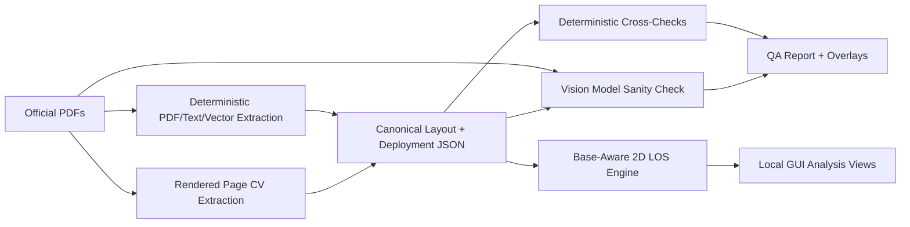

# Warhammer 40k LOS Analysis Tool Design

Date: 2026-06-16

## Goal

Build a local web application for visual analysis of Warhammer 40k table layouts, focused on base-aware 2D line-of-sight, firing-lane heatmaps, deployment exposure, terrain coverage, and interactive LOS simulation.

The app must automatically download and process the user-provided official terrain footprint and core rules PDFs:

- Terrain area footprints: `https://assets.warhammer-community.com/eng_12-06_warhammer40000_terrainareafootprints-biavo5zf9f-gxdahkydbj.pdf`
- Core rules: `https://assets.warhammer-community.com/eng_01-06_warhammer40k_new40k_core_rules-was6fbu1ix-hfewhmxyiy.pdf`

## Scope

The first implementation is a local GUI application with an extraction backend and interactive strategy views. It must:

1. Download and cache the official PDFs.
2. Extract terrain layouts, footprints, LOS-blocking wall or solid segments, board bounds, labels, and deployment-zone geometry automatically.
3. Use robust deterministic PDF parsing, text/vector extraction, and computer vision for production extraction.
4. Use a vision model only as a verifier/test oracle, never as the canonical geometry generator.
5. Normalize extracted geometry into canonical JSON.
6. Render QA overlays that compare extracted geometry against PDF page images.
7. Simulate base-aware 2D LOS.
8. Generate firing-lane heatmaps from many possible firing positions.
9. Generate movement/deployment exposure maps.
10. Show per-terrain coverage and interactive point/base LOS views.

Future builds may add height-aware or full 3D-aware LOS, but the first release stays 2D and base-aware.

## Architecture

Use a Python extraction and simulation backend with a TypeScript local web frontend.

The backend owns:

- PDF download and caching.
- PDF rendering to images.
- Text and vector extraction.
- Deterministic computer vision extraction.
- Geometry normalization.
- Deployment-zone extraction.
- Cross-checking stated and inferred measurements.
- Optional vision-model sanity checks.
- LOS and heatmap computation APIs.

The frontend owns:

- Local GUI shell.
- Board rendering.
- Source-PDF underlay display.
- Terrain, wall, deployment, and warning overlays.
- Base-size and analysis controls.
- LOS simulator interactions.
- Firing-lane heatmaps.
- Deployment exposure maps.
- Terrain coverage views.

The production data flow is:

The simulator consumes canonical JSON only. Raw PDF pixels are used for overlays and verification, not direct gameplay analysis.

## Canonical Data Model

Each extracted layout should be stored as versioned JSON with these top-level areas:

- `source`: PDF URL, local cache path, file hash, page number, render DPI, extraction version, extraction timestamp.
- `board`: physical dimensions in inches, detected pixel bounds, pixel-to-inch transform, coordinate origin and orientation.
- `terrain_layout`: layout id, page label, terrain features, footprint polygons, LOS-blocking wall or solid segments, feature labels, and feature-level status.
- `deployment`: deployment name, source page, deployment-zone polygons, no-man's-land geometry, stated distances, inferred distances, and validation status.
- `validation`: stated-vs-inferred measurement comparisons, vector-vs-image comparisons, tolerance results, unresolved warnings, and vision-model sanity verdict.
- `rules_assumptions`: 2D LOS assumptions, base-size assumptions, terrain-blocking assumptions, unsupported rules interactions, and future 3D extension notes.

Coordinates are normalized to board inches. The board should use one consistent origin, documented in the JSON schema and frontend renderer.

## Extraction Contract

Extraction must use two independent deterministic paths where possible:

1. Rendered/image inference detects the board, footprints, wall segments, labels, and page layout, then converts pixels to inches.
2. Text/vector inference extracts stated distances, dimension labels, layout identifiers, deployment-zone definitions, and PDF vector geometry where available.

The validator compares these paths:

- If text/vector and CV agree within tolerance, mark the feature verified.
- If CV detects a shape that text/vector misses, keep it provisional and flag it.
- If text/vector states a measurement and CV disagrees, do not silently correct it; mark a contradiction and show both values.
- If terrain or deployment geometry is deterministic from the source material, infer expected values and compare extracted values against those expectations.
- If the vision-model verifier reports that the rendered extraction does not visually resemble the source PDF image, mark the layout visually suspicious without mutating geometry.

The verifier should distinguish at least these states:

- `verified`
- `provisional`
- `missing`
- `contradicted`
- `low_confidence`
- `vision_suspicious`
- `unsupported`

## Vision Model Boundary

The vision model is allowed only for sanity checking and testing. It may compare a source PDF page image against a rendered image of extracted footprints, walls, labels, and deployment zones.

It must not:

- Create canonical footprint geometry.
- Rewrite wall segments.
- Infer deployment zones for production use.
- Override deterministic extraction.
- Be required for unit tests to pass.

Its output should be advisory: a verdict, a short explanation, and optionally coarse regions of concern for the QA overlay.

## LOS Model

The first LOS engine is base-aware 2D LOS.

Rules:

- A model is represented as a circular base on the board.
- Point LOS is available as a fast mode for heatmaps and debugging.
- Base-aware LOS checks whether visibility exists between the firing base and target base.
- LOS-blocking wall or solid segments block visibility.
- Terrain footprint polygons provide context, identity, and coverage analysis, but do not block LOS unless the extracted/rules geometry marks them as blockers.
- The board boundary clips all visibility and movement outputs.

The engine should be designed so future versions can add terrain height tiers, model height, windows/openings, and full 3D-aware LOS without replacing the canonical geometry model.

## GUI Views

### Layout QA

Show the source PDF image underlay with extracted overlays:

- Board bounds.
- Terrain footprints.
- LOS-blocking wall or solid segments.
- Labels.
- Deployment zones.
- Validation warnings.
- Vision-model sanity verdict, if available.

This view is the primary way to inspect extraction quality.

### Point/Base LOS Simulator

Let the user click a firing position, choose a base size, and view visible versus blocked board areas. The view should support point mode and base-aware mode.

### Firing-Lane Heatmap

Generate a heatmap from many possible firing positions. The user selects a source region such as a deployment zone, movement-reachable area, terrain feature, or whole board. For each board cell, count how many sampled firing positions can see it. Render higher counts with stronger intensity.

Controls should include terrain layout, deployment map, source region, base size, sampling density, and optional movement distance.

### Deployment Exposure

Choose a deployment map and movement distance. Show areas that can become exposed after moving from the selected deployment zone. This should use the same LOS engine and movement reachability model as the firing-lane heatmap.

### Terrain Coverage

Select a terrain feature and show areas it shields, exposes, or controls. This view should distinguish footprint context from actual LOS blockers.

## Testing And Verification

Testing should cover deterministic extraction, geometry behavior, simulation correctness, and GUI state.

Backend tests:

- PDF download, cache, hash, and source metadata tests.
- Extraction fixture tests for known pages.
- Board dimension and transform tests.
- Terrain count, footprint position, and wall segment tests.
- Deployment-zone polygon and distance tests.
- Stated-vs-inferred measurement validation tests.
- Synthetic geometry tests for LOS edge cases, tangent lines, blocker intersections, board clipping, and base-size behavior.
- Synthetic heatmap tests with known blockers and expected visibility counts.

Frontend tests:

- Layout loading.
- Overlay toggles.
- Validation warning display.
- Point selection.
- Base-size changes.
- Deployment selection.
- Firing-lane heatmap controls.
- GUI behavior when extraction warnings exist.

Vision-model checks:

- Run as optional sanity checks or manual QA aids.
- Do not mutate canonical geometry.
- Do not gate deterministic unit tests.
- Record their verdicts in the validation report.

## Failure Handling

Failures must be visible in the GUI and machine-readable in JSON.

Expected failure states include:

- PDF download failure.
- Cached file hash mismatch.
- Unsupported PDF page format.
- Missing board detection.
- Missing terrain geometry.
- Contradicted stated and inferred dimensions.
- Deployment-zone extraction failure.
- Low-confidence CV detection.
- Vision verifier unavailable.
- Vision verifier reports visual mismatch.
- LOS cannot run because required canonical geometry is invalid.

The app should prefer stale-but-visible extracted layouts over blank states when cached verified data exists.

## Non-Goals For First Release

- Full 3D-aware LOS.
- Automated strategic recommendations.
- Army list parsing.
- Multiplayer or cloud sharing.
- Mobile-first controls.
- Replacing official rules interpretation beyond the extracted deployment and terrain geometry needed for LOS analysis.

## Implementation Defaults

The implementation plan should start from these defaults unless a concrete blocker appears:

- Backend: Python with FastAPI for local APIs.
- PDF rendering, text, and vector extraction: PyMuPDF.
- Computer vision: OpenCV plus NumPy.
- Geometry operations: Shapely.
- Backend schema validation: Pydantic.
- Frontend: TypeScript, React, and Vite.
- Frontend schema validation: Zod generated or mirrored from backend schemas.
- Rendering: SVG for editable overlays and Canvas2D for dense heatmaps.
- Heatmaps: computed server-side first, returned as arrays or raster tiles for frontend display.
- Sampling density: 2 inch preview grid, 1 inch default grid, 0.5 inch high-resolution grid.
- Measurement tolerance: start at the larger of 0.125 inch or 0.5 percent of the compared dimension, then tune only with documented fixture evidence.
