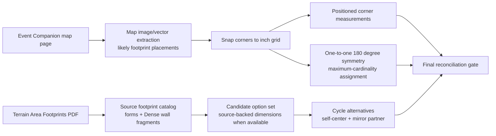
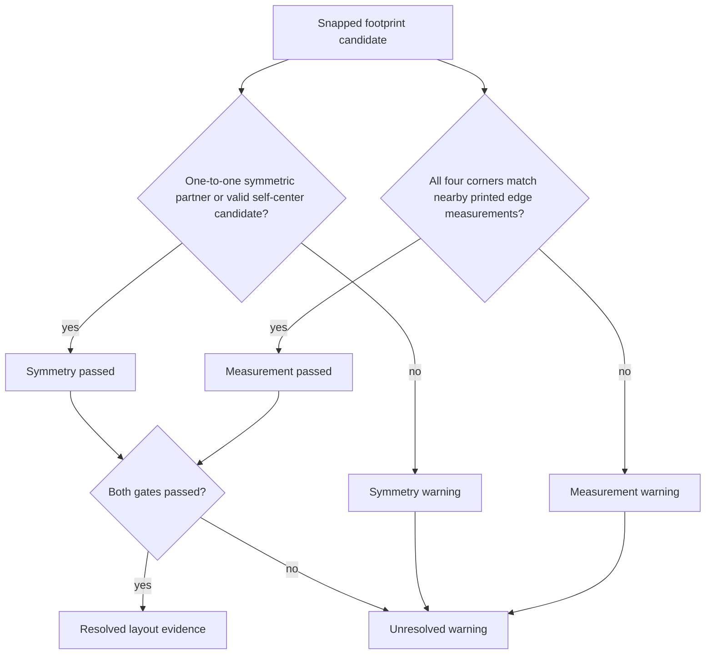

# Terrain Reconciliation

The reconciler keeps source footprint evidence separate from map placement evidence.
The current app does not treat a plausible map-image rectangle as final until
the snapped placement passes both printed measurement checks and symmetry checks.
When explicit inch dimensions are not printed in the Terrain Area Footprints PDF
text layer, the source catalog is built from official source-template matches
across the extracted official Event Companion corpus rather than from only the
currently selected map.

The two final evidence gates are parallel. A candidate that satisfies only one
gate remains warning-state evidence.

Current boundary: viable alternatives are reported as candidate evidence but are
not silently applied to canonical geometry. Future builds can add a deterministic
promotion step once the footprint catalog has explicit source-backed dimensions
for every standard GW footprint option.
